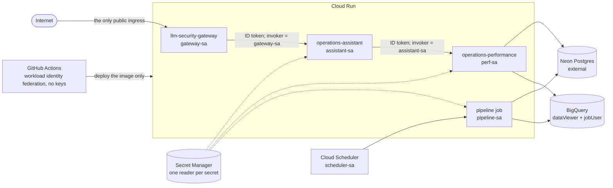

# northstar-infra

[](https://github.com/HerschCode/northstar-infra/actions/workflows/ci.yml)

Terraform, policy-as-code and CI for the **Northstar trilogy**: an LLM security gateway in front of an
LLM agent in front of an analytics API, all on Cloud Run, sized for the free tier, and locked down so
that **the internet can reach the gateway and nothing else.**

> **Status: code-complete and verified offline; not yet applied.** It was built before a billing
> account was available, so everything that needs a live project is written but unexercised. What is
> and is not proven is spelled out [below](#what-is-verified-and-what-is-not), and the exact commands
> for the first apply are in [docs/runbook.md](docs/runbook.md).



## What is different about it

* **Ten service accounts, no keys, no primitive roles.** One identity per workload, every grant on
  the resource it protects. Between services there are no shared API keys: each call carries a Google
  ID token, and Cloud Run IAM answers **403** to anyone else. The full table of who can do what is
  *generated from the plans*, so it cannot drift from the code:
  [docs/cloud-security.md](docs/cloud-security.md#2-identity-map).
* **The pipeline cannot rewrite its own permissions.** Two root modules: `envs/bootstrap`
  (budget, workload identity trust, CI identities; applied by a person, state in a bucket CI cannot
  reach) and `envs/dev` (the workloads; applied by CI, in a protected GitHub environment).
* **Policy-as-code that is itself tested against real plans.** 21 rules (no Owner/Editor for anyone,
  only the gateway may be public, one reader per secret, no public buckets, no service account keys, no
  always-on paid resources, ...) gate every plan. Beyond unit tests, **20 deliberately bad changes are
  planned with real `terraform plan` and must each be blocked**; that caught two gaps hand-written
  fixtures missed.
* **The "still private" claim is monitored, not just tested.** The uptime check for each private
  service passes *only* on HTTP 403, so it starts failing if one is ever opened to the public.
* **Cost guardrails as code.** A budget with alerts at ₹100 / ₹400 / ₹800 that the pipeline cannot
  edit, `max_instances` ceilings, scale-to-zero, and a rule that fails any plan adding Cloud SQL, a load
  balancer, NAT, a VPC connector or Cloud Armor. See [docs/cost.md](docs/cost.md).
* **Nothing floats.** Tools are pinned and checksum-verified, GitHub Actions are pinned by commit
  SHA, the provider is hash-locked for four platforms, and the CI job list is the same one
  `scripts/check.sh` runs on your laptop.

## What is verified, and what is not

**Verified offline, with no cloud credentials.** Every row is proven by a job in
[`ci.yml`](.github/workflows/ci.yml), which runs on GitHub-hosted runners with no secrets on every push
and pull request, and is reproducible on a laptop with `bash scripts/check.sh`. The last column links
to the job that does the checking, and `scripts/check-verified-table.py` (run by CI itself) fails if a
link stops pointing at a real job or a counted number stops matching the repository.

| What | Result | Proven by (CI job) |
|---|---|---|
| `terraform fmt` / `validate` | 10 modules and 2 roots clean | [`ci` › `terraform`](https://github.com/HerschCode/northstar-infra/blob/main/.github/workflows/ci.yml#L29) |
| Module unit tests (mocked provider) | 95 passing | [`ci` › `terraform`](https://github.com/HerschCode/northstar-infra/blob/main/.github/workflows/ci.yml#L29) |
| Credential-free plans | `envs/bootstrap` 51 resources, `envs/dev` 55, every IAM attribute known at plan time | [`ci` › `policy`](https://github.com/HerschCode/northstar-infra/blob/main/.github/workflows/ci.yml#L96) |
| tflint (with the Google ruleset) | 0 issues | [`ci` › `tflint`](https://github.com/HerschCode/northstar-infra/blob/main/.github/workflows/ci.yml#L62) |
| checkov | 108 passed, 0 failed; every suppression is justified in place | [`ci` › `security`](https://github.com/HerschCode/northstar-infra/blob/main/.github/workflows/ci.yml#L77) |
| Trivy (IaC and secrets) | 0 findings; suppressions justified in place | [`ci` › `security`](https://github.com/HerschCode/northstar-infra/blob/main/.github/workflows/ci.yml#L77) |
| Policy unit tests | 104 passing | [`ci` › `policy`](https://github.com/HerschCode/northstar-infra/blob/main/.github/workflows/ci.yml#L96) |
| Policy mutation tests (real plans) | baseline passes; 20 of 20 bad changes blocked by the named rule | [`ci` › `policy`](https://github.com/HerschCode/northstar-infra/blob/main/.github/workflows/ci.yml#L96) |
| Generated docs | module READMEs and the identity map match the code, every rule is documented, and this table's links and counts are true | [`ci` › `docs`](https://github.com/HerschCode/northstar-infra/blob/main/.github/workflows/ci.yml#L140) and [`ci` › `policy`](https://github.com/HerschCode/northstar-infra/blob/main/.github/workflows/ci.yml#L96) |
| Workflow syntax | actionlint, with shellcheck on every `run:` block | [`ci` › `workflows`](https://github.com/HerschCode/northstar-infra/blob/main/.github/workflows/ci.yml#L125) |

The counts of tests, mutations and rules are checked against the repository; the other totals
(resources per plan, checkov's pass count) are from the run before the first push, and CI enforces "no
failures" rather than those exact numbers.

**Not verified, because it needs a live project:** the apply itself; the credentialed halves of
[`plan.yml`](.github/workflows/plan.yml), [`apply.yml`](.github/workflows/apply.yml) and the apps'
`deploy.yml` (everything after their `preflight`, which is a no-op until the repository variables
exist); the HTTP-403 verification in [docs/cloud-security.md](docs/cloud-security.md#5-verification); the
uptime checks, alerts and log metric on real traffic; and seven specific assumptions listed in
[docs/runbook.md](docs/runbook.md#assumptions-to-confirm-on-first-apply). The application side is
written but has not run on Cloud Run: the ID-token calls are implemented behind
`AUTH_MODE=google_id_token` and unit-tested with Google mocked, in the pull requests listed in
[docs/app-integration.md](docs/app-integration.md); the JSON decision log the block-rate alert needs is
not done.

**Deliberately not built:** the optional automatic billing cut-off. It cannot be validated without a
live billing account and it is destructive; the reasons and the permission it would really need are
in [`modules/budget_guard`](modules/budget_guard/README.md).

## Repository map

```text
envs/
  bootstrap/   identity plane, applied by a person: APIs, budget, workload identity, CI identities, audit logs
  dev/         workloads, applied by CI: three Cloud Run services, the pipeline job, secrets, BigQuery, monitoring
modules/       naming  service_account  secret  artifact_registry  cloud_run_service  cloud_run_job
               bigquery_dataset  wif_github  monitoring  budget_guard      (each with tests and a README)
policies/      conftest / OPA rules, their unit tests, and the mutation tests that plan real bad changes
scripts/       offline-plan  policy-mutation-tests  identity-map  install-tools  check  gen-docs  check-verified-table
docs/          cloud-security (the IAM write-up)  runbook  cost  app-integration  tour
.github/       ci (no credentials), plan (read-only identity), apply (manual, protected), dependabot, codeowners
```

## Try it (no cloud account needed)

Needs `bash`, `curl`, `unzip` and Python 3 (on Windows, Git Bash).

```bash
bash scripts/install-tools.sh              # pinned Terraform, tflint, conftest, Trivy, terraform-docs, checkov
export PATH="$PWD/.tools/bin:$PATH"        # (the tools are checksum-verified downloads, kept in ./.tools)
bash scripts/check.sh                      # everything CI runs, about three minutes
bash scripts/check.sh quick                # skip the slow mutation tests
```

To see the gate stop a bad change, plan one of the deliberate mistakes and hand it to conftest:

```bash
bash scripts/offline-plan.sh dev plan.json policies/mutations/03-assistant-made-public.override.tfmutation
conftest test plan.json -p policies        # FAIL ... [RUN-001] ... lets anyone on the internet invoke "operations-assistant"
```

## Documentation

| | |
|---|---|
| [docs/cloud-security.md](docs/cloud-security.md) | Threat model, identity map, removed secrets, policy rules, verification, defence in depth with the gateway's LLM firewall, residual risks |
| [docs/runbook.md](docs/runbook.md) | Create the project, apply in order (budget first), verify the 403s, tear down and prove nothing billable is left |
| [docs/cost.md](docs/cost.md) | What is free, what this actually uses, what is deliberately avoided (prices read on 2026-09-24) |
| [docs/app-integration.md](docs/app-integration.md) | The `AUTH_MODE` contract the apps implement, the status of each app's pull request, and the manual deploy workflow they share |
| [docs/tour.md](docs/tour.md) | One page: the rules that matter most and the attack each prevents, the design choices, and the questions worth being ready for |

## The applications

[`operations-performance`](https://github.com/HerschCode/operations-performance) (analytics API, the data
layer) → [`operations-assistant`](https://github.com/HerschCode/operations-assistant) (LLM agent that uses it as
tools) → [`llm-security-gateway`](https://github.com/HerschCode/llm-security-gateway) (the firewall in front).
Each has a pull request (listed in [docs/app-integration.md](docs/app-integration.md#status)) that adds a
manual deploy workflow and a note linking back here, and, for the two that call another service, the
`AUTH_MODE=google_id_token` client code.
